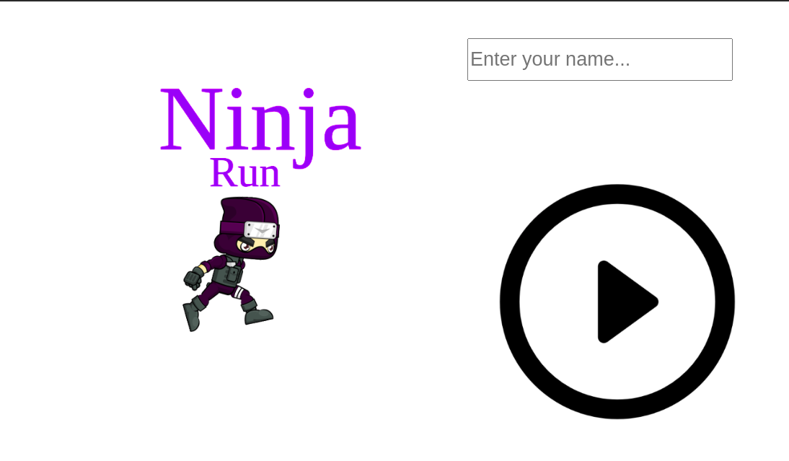
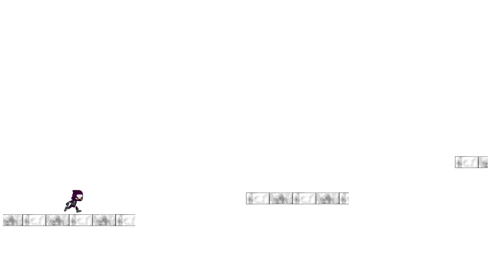
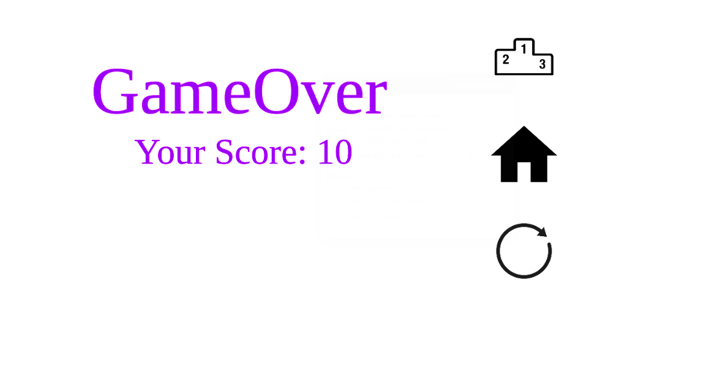
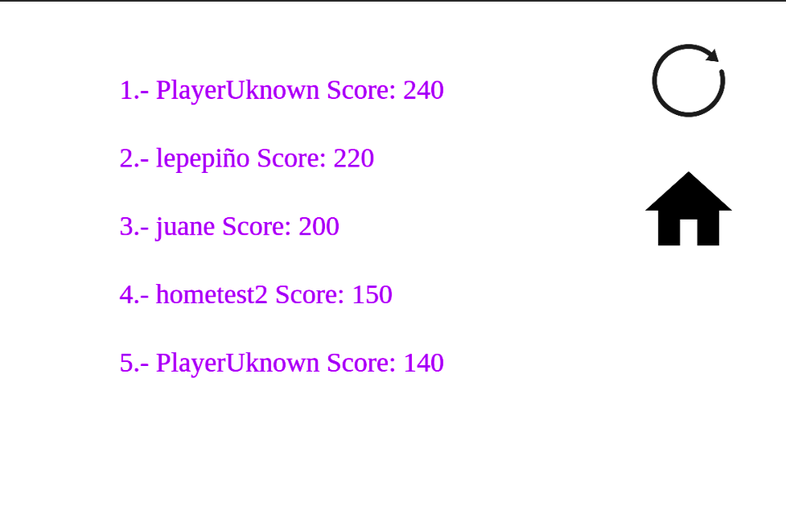

# Ninja Run The Game
Is a game where the Ninja is trying to steal the treasure from the castle but he has to escape with it but also he will collect more parts of the treasure in his journey.

This game is a platformer made with the Phaser library as a Capstone Project for the JavaScript module from the Microverse technical curriculum.

## Built With

- JavaScript,
- Phaser,
- Webpack,
- Jest,
- API

## Live Demo

[Ninja Run Demo](https://fierce-eyrie-64717.herokuapp.com/)

# How to play

When you start the page it will show you the title screen: 

On this screen, you will have to enter your name so the game can start. If no name is entered your score will be from a unknown player.

Then you will go into the game itself, where the ninja will start running on a long platform. To **make ninja jump** use a **mouse click**.

To make it a little more fair to ninja the game has the double jump functionality, so he can get to those further platforms that randomly show up. The double jump can be activated when ninja is already in the air by hitting the jump action button again.

Through the game, you will find these coins. If you collect one of those you will get an extra 30 points.

After ninja falls into the abyss, you are taken to the game over scene, where you can see your score and some buttons.

The buttons give the options: 
- To start over the game with the same player name.
- Go to the title screen where you can enter a new player name.
- See the scoreboard with the top 5 scores in the game.

You can check if you made it and if you are at the top of the board.

## Game Design Document

[GD Document](./docs/gameDesign.md)

## Setup

To run the game locally you will need to follow several steps to make it work.

First, you have to check if you have **nodejs** installed on your machine. For this type the following command in your terminal:

> node -v

If **command not found** shows as a response, then go to [nodejs.org](https://nodejs.org/en/) and follow the instructions to install it. After completing the installation the same command should show you a version number.

Then clone the [repository](https://github.com/pastorp3/Js-Game.git) into your local drive and open a terminal in the root folder of the project and install the necessary packages to make it work by running this command:

> npm install

This will get the project ready to run. After this compile the project just in case by running the following command:

> npm run build

Make sure you have a folder called **dist** in the root of the project so it doesn't throw any errors.

Next, you have to install some kind of server to run it in your browser. I recommend using the live server extension from Ritwick Dey for VSCode but something like [XAMPP](https://www.apachefriends.org/) can also be used or run the next script and it will open a local server with http-server dependenci:

> npm start

Then start the server on the **index.html** file located in the **dist** folder and that is it, you are ready to go

## Tests

This project has a suite of tests built-in.

To run the tests clone the [repository](https://github.com/pastorp3/Js-Game.git) into your local drive, if you haven't done so, and open a terminal in the root folder of the project and install the necessary packages to make it work by running this command:

> npm install

Then you can just run the following command and see the results

> npm test

## Authors

👤 **José Pedraza**

- Github: [@pastorp3](https://github.com/pastorp3)
- Twitter: [@jose_pastor](https://twitter.com/jose_pastorp3 )
- Linkedin: [linkedin](https://www.linkedin.com/in/jos%C3%A9-pedraza-acevedo-ab700a1a9/)

## 🤝 Contributing

Contributions, issues, and feature requests are welcome!

Feel free to check the [issues page](issues/).

## Show your support

Give an ⭐️ if you like this project!

## Acknowledgments

- Microverse
- GameArt2d.org
- Emanuele Feronato
- Photon Storm

## 📝 License

This project is [MIT](https://opensource.org/licenses/MIT) licensed.

## Credits

All the assets in the game were taken from OpenGameArt.org and GameArt2d.com from the free section. A big thank you to the creator of these assets **Zuhria Alfitra a.k.a pzUH**.

